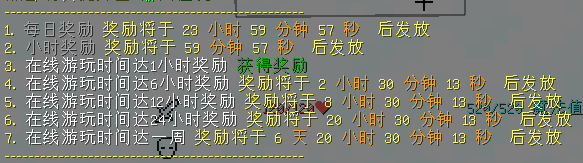

# 插件生存服介绍

import Tabs from '@theme/Tabs';
import TabItem from '@theme/TabItem';

本篇介绍了生存服的玩法、指令、机制以及部分插件内容。

TODO: 在此向各位玩家征求游戏内地表、美景的图片，择优放置在此。其他会放在画廊。

***

## 玩法提示

:::note[版本]

本服主版本（世界版本）为 `1.21`

:::

本服启用了 `更多附魔`、`技能`、`领地` 等游戏性玩法，并启用了一些功能性玩法，如 `地标`、`家`、`传送申请`、`菜单` 等。  
并设置了 `游戏币` 作为经济系统，同时添加了 `箱子商店`。

### 新手指引

1. 从主城的 `跨服菜单` 中加入本服务器；
2. 加入服务器后，可以先打开 `菜单` - `礼包` 来领取新手礼包（如果没有自动给予）；
3. 给予的物品都有用处，同时会赠送一本书，里面介绍了新手礼包工具的用途。
4. 可以在出生点收集资源，但是不推荐将家设在出生点附近。

:::tip

本服不允许建造占地超四个区块的大型生电机器。

如果你不知道粘液科技是什么，或者对它的玩法不了解，欢迎阅读：[粘液科技教程](https://slimefun-wiki.guizhanss.cn/Home)。

:::

## 指令提示

* `/bs` 打开菜单
* `/shout <内容>` 可进行跨服喊话
* `/co i` 可以打开查询模式，再次输入关闭（可以用来看谁动了箱子里的东西、谁放了方块等）

## 机制列表

### 经济系统

本服禁用了系统商店和收购系统，因为粘液科技会带来巨大的通货膨胀。

<Tabs>
  <TabItem value="get" label="赚钱" default>
    1.通过箱子商店和其他玩家交易  
    2.从 `礼包` 里进行签到  
    3.从在线奖励获得  
    4.其他   
  </TabItem>
  <TabItem value="out" label="花钱">
    通过箱子商店和其他玩家交易 
  </TabItem>
</Tabs>

### 玩法类

* 进行一些游戏行为（如：采矿，打怪）可以获得 `技能` 经验以及升级 `Ranks`。
* 手持物品左键单击箱子可以创建 `箱子商店`。
* 通过菜单可以打开 `自定义配方` 列表。

:::info[在线奖励]

使用指令 `/cmi prewards` 立即打开页面。

:::

### 显示类

* 把鼠标放到聊天消息上可以显示更多信息。
* 手持指南针可以显示方向。
* 鞘翅飞行时可以显示速度。

### 其他

* 右键楼梯或半砖可以坐下

## 部分插件列表

* CMI
* LuckPerms
* Residence
* AuraSkills
* QuickShop

:::tip

服内有部分菜单未创建完整GUI，请移步维基查看。

:::

