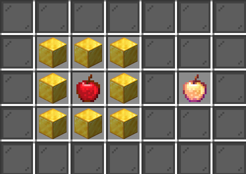
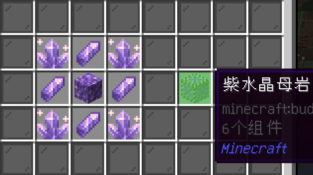
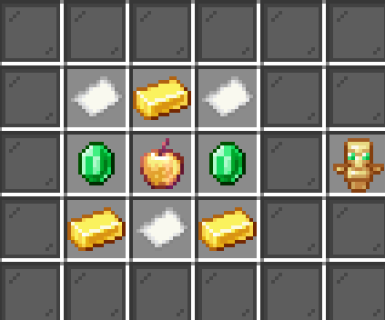

# 插件生存服介绍

import Tabs from '@theme/Tabs';
import TabItem from '@theme/TabItem';

本篇介绍了生存服的玩法、指令、机制以及部分插件内容。

TODO: 在此向各位玩家征求游戏内地表、美景的图片，择优放置在此。其他会放在画廊。

***

## 新手指引

:::note[版本]

本服主版本（世界版本）为 `1.21`

:::

本服启用了 `粘液科技`、`更多附魔`、`技能`、`领地` 等游戏性玩法，并启用了一些功能性玩法，如 `地标`、`家`、`传送申请`、`菜单` 等。  
并设置了 `游戏币` 作为经济系统，同时添加了 `箱子商店`。

**步骤**：

1. 从主城的 `跨服菜单` 中加入本服务器；
2. 加入服务器后，可以先打开 `菜单` - `礼包` 来领取新手礼包（如果没有自动给予）；
3. 给予的物品都有用处，同时会赠送一本书，里面介绍了新手礼包工具的用途。
4. 可以在出生点收集资源，但是不推荐将家设在出生点附近。
5. `菜单` 中包含许多有用的信息，请多留意。

:::tip

本服不允许建造占地超四个区块的大型生电机器。 。

:::

## 玩法机制

### 经济系统

本服禁用了系统商店和收购系统，因为 `粘液科技` 和允许矿透的规则通常会带来巨大的通货膨胀。

**交易和获得游戏币的方法**：

1. 通过箱子商店和其他玩家交易  
2. 从 `菜单` - `礼包` 里进行签到  
3. 从 `菜单` - `在线奖励` 获得
4. 其他

### 保护自己的家

#### 查询 

查询可以帮助你找到谁动了你的东西，谁拿了你的物品等等。

使用指令 `/co i` 可以打开查询模式，再次输入关闭。

#### 领地 

:::tip

我们十分推荐你设置领地，这可以避免很多不必要的麻烦。获得游戏币的方法请参阅 [经济系统](#经济系统)

:::

请参阅： [`Dominion 4 玩家手册`](https://dominion.lunadeer.cn/notes/doc/player/)

### 粘液科技

:::tip

如果你不知道粘液科技是什么，或者对它的玩法不了解，欢迎阅读：[`粘液科技教程`](https://slimefun-wiki.guizhanss.cn/Home)

:::

**当前包含以下附属**：

待安装

#### 安装材质包

[`点击下载粘液科技材质包`](https://cdn.modrinth.com/data/TznkVJky/versions/KcSQM2t9/Slimefun-ResourcePack.zip) 当前更新日期为 `2025-5-3` （当此时间变动时，请重新下载材质包）

随后将下载的材质包放入 Minecraft 材质包文件夹并加载即可。

### 箱子商店

请参阅：[`维基`](https://quickshop-community.github.io/QuickShop-Hikari-Documents/zh-CN/docs/category/features)

### 自定义配方

点击打开折叠项目

:::note

如果您想要更多的配方，请联系我们进行建议。

:::

### 玩家技能

> 玩家通过一般 Minecraft 任务（例如农业、采矿、战斗或附魔）获得技能 XP 来升级技能。提高每个技能的等级会为玩家提供属性增益、解锁和升级被动和法力能力以及其他可定制的奖励。 —— 官方维基

这部分并不需要介绍，因为他的 GUI 系统已经足够详细。  
`/sk` 命令或通过 `菜单` - `技能` 打开他的 GUI。

### 更多附魔

同样，这个玩法已经有 GUI 介绍了。  
通过 `菜单` - `更多附魔` 打开他的 GUI。

### 显示类功能

* 可以把鼠标放到聊天消息上来显示更多信息。
* 手持指南针可以显示方向。
* 鞘翅飞行时可以显示速度。
* 聊天框发送 `[item]` 可以展示当前手中的物品。

### 其他

* 右键楼梯或半砖可以坐下

## 指令提示

<Tabs>
  <TabItem value="default" label="基础" default>
     `/bs` 打开菜单

     `/sf guide` 可以获得粘液书 
  </TabItem>
  <TabItem value="chat" label="聊天">
     `/shout [内容]` 可进行跨服喊话  
     `/tell [玩家] [内容]` 和其他玩家私聊  
     `/reply [内容]` 回复刚刚向你发送私聊的玩家
  </TabItem>
  <TabItem value="tp" label="传送">
    Tip: 菜单里有地标，家以及回主城的传送选项。  
    `/tpa [玩家]` 申请传送到玩家   
    `/tpahere [玩家]` 申请传送到玩家
  </TabItem>
</Tabs>

## 部分插件列表

* CMI
* LuckPerms
* Dominion
* AuraSkills
* QuickShop

:::tip

服内有部分菜单未创建完整GUI，请移步维基查看。

:::

