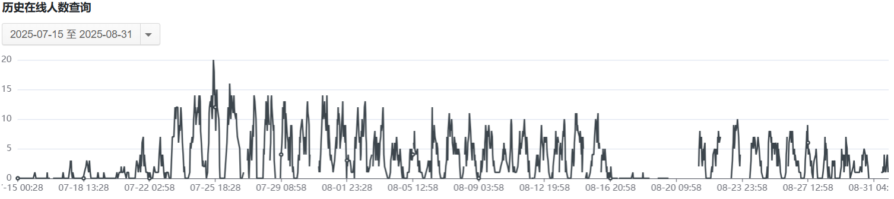
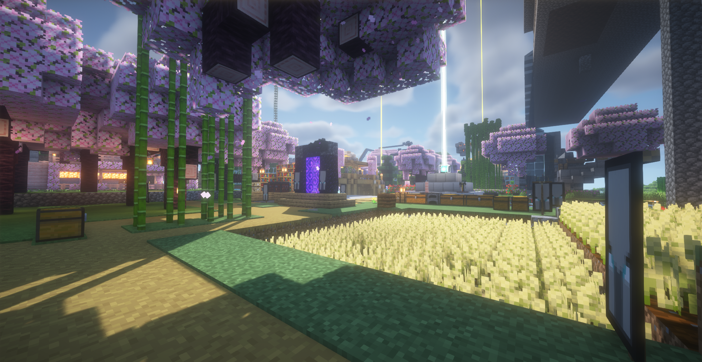
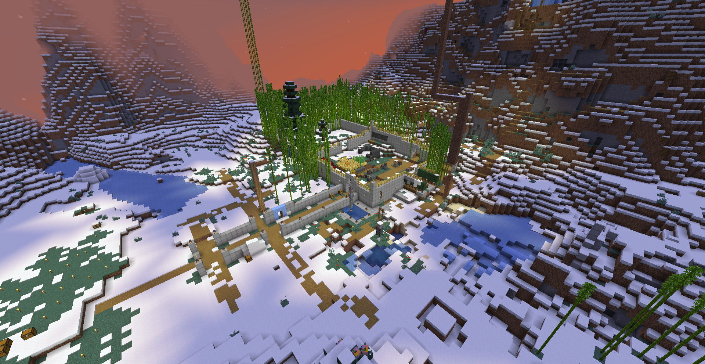
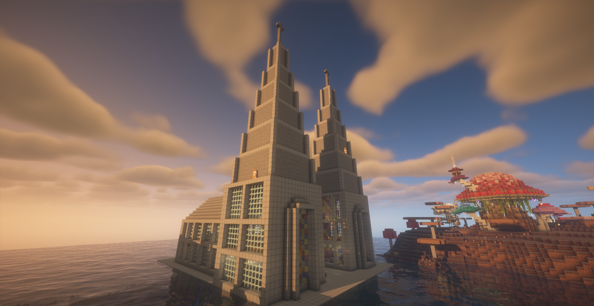

# 国庆 | 周年庆 —— 2025 社区年刊

光阴似箭，时光如梭。我们迎来了 2025 年国庆节和中秋节，同时也是社区成立 3 周年的时间节点。

## 发展概述

<!--truncate-->

`跨年`夜开放了 2025 新年地图，当时共有 16 名玩家一起跨年。

***

`寒假` 宣传没有取得良好的效果，服内玩家数量少。  
引入了部分 **小游戏**，以增强主城的趣味性，同时防止玩家在主城过于无聊。  
**开放生存二服**，这是一个以 **粘液科技** 为主的插件生存服，包含了许多新颖的玩法。  
并且发布了生存二服的宣传片，但是并未获得较高关注。

***

`暑假` 玩家数量较多，将二服分成了 **生电** 和 **粘液科技** 两个部分。
  
购买了新的服务器，主频 4.0 GHz，满足生电服的需求。  
游玩过程中多次出现网络波动，问题需要解决。  
将生存服玩家群与旧群分开，建立了新的群。  
发布了 wenjian 制作的整活视频。

## 服务器内成果展示

## 管理组人事变动

点击打开折叠项目

2025-1-20:
1. `pingguo` 担任 *第四任* `腐竹`
2. `wenjian` 担任 *第三任* `运维`

2025-7-8: `Snowphier` 担任 `管理`

2025-8:
1. `good344654` 担任 `技术`
2. `Lier_dog` 担任 `群主`、`建筑`
3. `WCPt` 担任 `协管`

## 下一年发展计划

* 研究制造和运营模组服务器
* 制作封禁插件和称号插件
* 宣传计划（待制定）
* 其他（敬请关注后续）

## 结语

本年度社区发展整体良好，但仍存在问题，需要及时修复。

最后，`热烈庆祝中华人民共和国成立 76 周年` 和 **红星我的世界社区成立 3 周年**。 

—— RedStarMC社区管理组